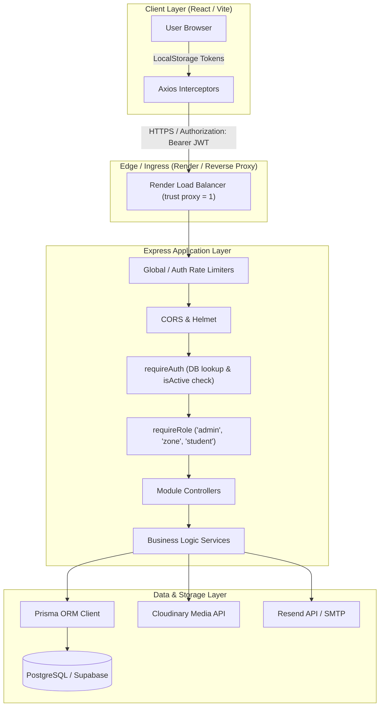
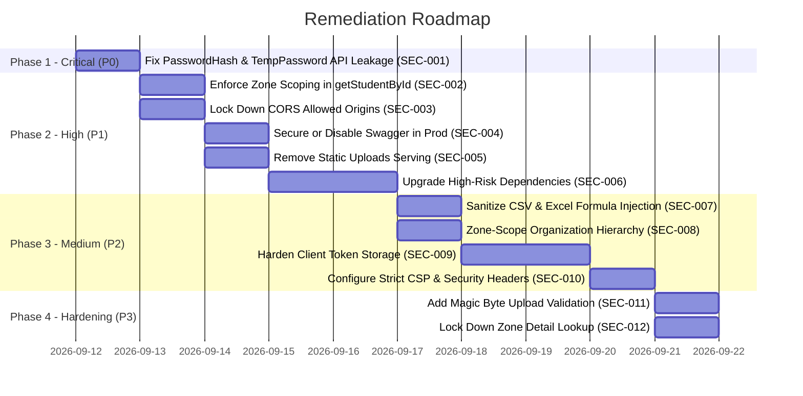

# Maatram Portal Security Audit Report
**Enterprise Application Security, Architecture, & Penetration Testing Review**
**Evaluation Date:** September 2026 | **Target Version:** v1.0.0-Staging / Pre-Production

---

## 1. Executive Summary

This document presents the findings of a comprehensive, read-only enterprise security audit conducted on the **Maatram Portal (Student & Volunteer Management System)**. The objective of this audit is to identify security risks, architectural flaws, access control vulnerabilities, and compliance gaps across both the backend Express/TypeScript/Prisma API and the frontend React/TypeScript application prior to production deployment.

### Audit Summary Statistics
- **Overall Security Rating:** `5.5 / 10`
- **Critical Findings:** `1`
- **High Findings:** `5`
- **Medium Findings:** `4`
- **Low Findings:** `3`
- **Deployment Readiness:** **NOT READY (Blocked until Phase 1 Critical & High items are remediated)**

### Primary Takeaways
1. **Critical Secret Leakage in APIs:** Administrative user queries (`GET /api/v1/users` and `GET /api/v1/users/:id`) return raw `User` database records including bcrypt `passwordHash` and `tempPassword` fields due to unprojected Prisma relations. Furthermore, student directory listings expose plaintext `tempPassword` values.
2. **Broken Zone Isolation (BOLA / IDOR):** While several listing and aggregate analytics routes properly enforce Zone scoping, single-record lookups (notably `GET /api/v1/students/:id`) lack Zone boundary checks, allowing a Zone Incharge to view complete profiles and PII of students in any other zone.
3. **CORS Regex Wildcard Risk:** Permissive regular expressions (`/^https:\/\/.*\.onrender\.com$/` and `/^https:\/\/.*\.vercel\.app$/`) with `credentials: true` permit any third party hosting an application on Render or Vercel subdomains to perform authenticated cross-origin requests.
4. **Export Formula Injection:** Student and zone CSV exports do not sanitize spreadsheet formula control characters (`=`, `+`, `-`, `@`), presenting a Client-Side CSV/DDE injection vulnerability.
5. **High-Risk Vulnerable Dependencies:** Production dependencies include unpatched packages with known high-severity CVEs (`xlsx`, `multer`, `nodemailer`).

---

## 2. Audit Scope

The security review encompassed 100% of the repository codebase without applying source code modifications:

| Component | Path | Key Technologies Audited |
| :--- | :--- | :--- |
| **Server Core & Config** | `server/src/`, `server/src/config/` | Express, Helmet, CORS, Rate Limiters, Swagger, Env Schema |
| **Authentication & IAM** | `server/src/modules/auth/`, `server/src/utils/` | JWT, bcryptjs, Refresh Token Rotation, Password Reset |
| **Authorization & RBAC** | `server/src/common/middleware/` | Role-Based Access Control (`admin`, `zone`, `student`) |
| **Database & ORM** | `server/prisma/`, `server/src/modules/**/repository` | Prisma ORM, PostgreSQL (Supabase), Transactions |
| **Business Modules** | `server/src/modules/` | Student, Volunteer, Profile, Zone, User, Org, Analytics, Audit |
| **Client Application** | `client/src/` | React, Vite, Axios interceptors, Token storage, Routing |
| **Media & File Storage** | `server/src/utils/cloudinary.ts`, `server/uploads/` | Multer, Cloudinary SDK, Static serving |
| **Dependencies & Env** | `package.json`, `.env.example`, `.gitignore` | npm dependencies, secret exposure, configuration |

---

## 3. Architecture & Attack Surface



### Attack Surface Overview
1. **Unauthenticated Public Endpoints:**
   - `/health`, `/health/database`, `/health/mail`
   - `/api-docs` (Swagger UI documentation)
   - `/uploads/*` (Raw static file access)
   - `/api/v1/auth/login`, `/api/v1/auth/refresh`, `/api/v1/auth/forgot-password`, `/api/v1/auth/reset-password`
2. **Student Authenticated Endpoints:**
   - Profile self-service (`GET/PUT /api/v1/profile`, skills, projects, certifications, upload)
   - Self-resume access (`GET /api/v1/students/me/resume`)
   - Volunteer activity logging (`POST /api/v1/volunteers/`, upload proof, list own submissions)
3. **Zone Incharge Authenticated Endpoints:**
   - Student directory for assigned zone (`GET /api/v1/students`, `GET /api/v1/students/:id`, `PATCH /:id/status`, `PATCH /:id/spoc`)
   - Volunteer log review & approval (`GET /api/v1/volunteers/logs`, `PATCH /:id/status`, `PATCH /:id/comment`)
   - Zone-scoped analytics & dashboard (`GET /api/v1/analytics/*`)
   - Team member directory (`GET /api/v1/users`, `GET /api/v1/users/:id`, `GET /api/v1/users/export`)
   - Audit logs (`GET /api/v1/audit-logs`, `GET /api/v1/audit-logs/:id`)
4. **Super Admin Authenticated Endpoints:**
   - Full student provisioning, Excel batch imports, templates, bulk actions
   - Administrative user provisioning, activation, deactivation
   - System-wide organization & zone lifecycle management
   - System-wide analytics & unrestricted audit log inspection

---

## 4. Security Posture Summary

| Area | Status | Severity | Notes |
| :--- | :--- | :--- | :--- |
| **Authentication Core** | PASS | LOW | Bcrypt (salt 12), SHA-256 hashed refresh tokens, token rotation, reuse detection. |
| **Password Storage & Leakage** | FAIL | **CRITICAL** | User password hashes and temp passwords exposed in user and student APIs. |
| **RBAC Enforcement** | PARTIAL | HIGH | Strict role gating on routes, but missing resource-level ownership in specific handlers. |
| **Zone Isolation / BOLA** | PARTIAL | **HIGH** | `GET /api/v1/students/:id` missing zone check; bulk/list/exports properly checked. |
| **CORS & Network Security** | FAIL | **HIGH** | Permissive regex matching on all `*.vercel.app` and `*.onrender.com` domains. |
| **API Documentation** | FAIL | **HIGH** | Swagger `/api-docs` exposed publicly without authentication. |
| **Static File Uploads** | FAIL | **HIGH** | Static `/uploads` route publicly accessible without authentication. |
| **Input Validation** | PASS | LOW | Comprehensive Zod schemas on body/query across all state-mutating routes. |
| **SQL Injection** | PASS | NONE | 100% Prisma parameterization; zero raw SQL queries (`$queryRaw`) present. |
| **Mass Assignment** | PASS | LOW | Zod strict parsing + explicit DTO mappings across repositories. |
| **Excel / CSV Injection** | FAIL | **MEDIUM** | Formula sanitization absent in `student.service.ts` CSV export generator. |
| **Information Leakage** | PARTIAL | **MEDIUM** | Global hierarchy exposed to Zone Incharge; stack traces suppressed in production. |
| **Client Token Storage** | PARTIAL | **MEDIUM** | Tokens stored in `localStorage` instead of HttpOnly cookies. |
| **Dependencies (CVEs)** | FAIL | **HIGH** | Outdated `xlsx`, `multer`, `nodemailer` with active GitHub advisories. |
| **Audit Logging** | PASS | LOW | Comprehensive actor/action/target logging with client IP and User-Agent capture. |

---

## 5. Critical Findings

### SEC-001 — Password Hash & Plaintext Temp Password Exposure via Administrative User and Student Directory APIs
- **Severity:** `CRITICAL`
- **Risk:** Account Takeover, Credential Compromise, Administrative Privilege Escalation
- **Affected Components:** `User` Module, `Student` Module
- **Affected Files:**
  - `server/src/modules/user/user.repository.ts` (lines 81–91, 136–153)
  - `server/src/modules/user/user.service.ts` (lines 228–258, 263–269)
  - `server/src/modules/student/student.service.ts` (lines 450–466)
- **Description:**
  1. `userRepository.list` and `userRepository.findById` query the database using Prisma `include: { userProfile: true, organization: true, zone: true }` without specifying a `select` clause for the parent `User` entity. In Prisma, omitting a `select` returns all scalar fields of `User`, including `passwordHash` (bcrypt hash) and `tempPassword`.
  2. The `userService.listUsers` and `userService.getUser` methods pass these un-sanitized entities directly to the client response.
  3. The `user.routes.ts` file grants `requireRole('admin', 'zone')` access to `GET /api/v1/users` and `GET /api/v1/users/:id`. Consequently, any authenticated Zone Incharge can view the password hashes of all Super Admins.
  4. In `student.service.ts` (lines 460, 842), `tempPassword` is explicitly returned in `listStudents` and exported in CSVs.
- **Attack Scenario:**
  1. An attacker gains access to a Zone Incharge account.
  2. The attacker calls `GET /api/v1/users` to retrieve the user list.
  3. The API responds with the full object of the Super Admin, including `passwordHash: "$2a$12$..."`.
  4. The attacker runs an offline dictionary or Hashcat attack against the bcrypt hash to recover the Super Admin password and gain root control.
- **Evidence:**
  ```typescript
  // server/src/modules/user/user.repository.ts lines 136-153
  async list(where: Prisma.UserWhereInput, skip: number, take: number, orderBy: ...) {
    return prisma.user.findMany({
      where, skip, take, orderBy,
      include: { userProfile: true, organization: true, zone: true }, // Returns passwordHash & tempPassword!
    });
  }

  // server/src/modules/student/student.service.ts line 460
  const safeUser = student.user ? {
    id: student.user.id,
    email: student.user.email,
    tempPassword: student.user.tempPassword, // Plaintext temporary password returned in list!
    ...
  } : undefined;
  ```
- **Impact:** Total compromise of system credentials and horizontal/vertical privilege escalation.
- **Recommended Remediation:**
  1. In `user.repository.ts`, replace top-level `include` with an explicit `select` that excludes `passwordHash` and `tempPassword`.
  2. In `student.service.ts`, remove `tempPassword` from the mapped user object returned in `listStudents` and only expose temporary passwords in dedicated, single-use provisioning responses.
- **Priority:** `P0 (Immediate)`

---

## 6. High Findings

### SEC-002 — Broken Zone Isolation & BOLA/IDOR on Single Student Profile Access
- **Severity:** `HIGH`
- **Risk:** Unauthorized Cross-Zone PII & Student Record Disclosure
- **Affected Components:** `Student` Controller & Service
- **Affected Files:**
  - `server/src/modules/student/student.routes.ts` (line 35)
  - `server/src/modules/student/student.controller.ts` (lines 41–46)
  - `server/src/modules/student/student.service.ts` (lines 247–256)
- **Description:**
  `GET /api/v1/students/:id` is accessible to both `admin` and `zone` roles. While `listStudents`, `exportStudents`, `changeStatus`, and `getStudentResume` explicitly enforce Zone Incharge boundary verification, `getStudentById` fetches the student by primary key without checking if `student.zoneId === requester.zoneId`.
- **Attack Scenario:**
  1. A Zone Incharge assigned to "Zone North" issues a request `GET /api/v1/students/<zone-south-student-uuid>`.
  2. The server processes the request without validating whether the student belongs to Zone North.
  3. The full personal record (date of birth, parent details, address, mobile numbers, academic records) of the Zone South student is returned.
- **Evidence:**
  ```typescript
  // server/src/modules/student/student.controller.ts lines 41-46
  getStudentById = asyncHandler(async (req: Request, res: Response): Promise<void> => {
    const { id } = req.params;
    // Missing: Zone scope validation for req.user.role === 'zone'
    const student = await studentService.getStudentById(id);
    ResponseFormatter.success(res, student, 'Student profile retrieved successfully');
  });
  ```
- **Impact:** Violation of multi-tenant/zone isolation boundaries, leaking sensitive student PII to unauthorized regional coordinators.
- **Recommended Remediation:**
  Enforce zone authorization in `student.service.ts` or `student.controller.ts`: if `requester.role === 'zone'`, verify that `student.zoneId === assignedZoneId`.
- **Priority:** `P1`

---

### SEC-003 — Permissive Wildcard Regex in CORS Configuration with Credentials Enabled
- **Severity:** `HIGH`
- **Risk:** Cross-Origin Exploitation, Session Hijacking, Unauthorized API Execution
- **Affected Components:** `app.ts` Express Middleware
- **Affected Files:** `server/src/app.ts` (lines 60–79)
- **Description:**
  The CORS origin validation callback allows any origin matching `/^https:\/\/.*\.onrender\.com$/` or `/^https:\/\/.*\.vercel\.app$/` and configures `credentials: true`. Because anyone can register free subdomains on `vercel.app` or `onrender.com`, an external attacker can host an arbitrary malicious web application and make authenticated API calls against the backend.
- **Attack Scenario:**
  1. An attacker registers `https://malicious-portal.vercel.app`.
  2. An authenticated Maatram Super Admin visits the attacker's page while logged into the portal.
  3. JavaScript on the attacker's page issues requests (e.g. `POST /api/v1/users`) to the Maatram backend API with `withCredentials: true`.
  4. The CORS middleware allows the origin, permitting the attacker to perform unauthorized state mutations.
- **Evidence:**
  ```typescript
  // server/src/app.ts lines 66-68
  const isAllowed =
    allowedOrigins.includes(normalizedOrigin) ||
    /^https:\/\/.*\.onrender\.com$/.test(normalizedOrigin) ||
    /^https:\/\/.*\.vercel\.app$/.test(normalizedOrigin);
  ```
- **Impact:** Broken Cross-Origin isolation enabling Cross-Site Request execution with full credentials.
- **Recommended Remediation:**
  Remove regex wildcards from CORS configuration. Restrict allowed origins strictly to explicit, environment-configured domains (`env.FRONTEND_URL.split(',')`).
- **Priority:** `P1`

---

### SEC-004 — Unauthenticated Swagger API Documentation in Production
- **Severity:** `HIGH`
- **Risk:** Attack Surface Enumeration, Architecture Reconnaissance
- **Affected Components:** API Documentation Configuration
- **Affected Files:**
  - `server/src/app.ts` (line 92)
  - `server/src/config/swagger.ts` (lines 61–63)
  - `server/src/config/env.ts` (lines 38–39)
- **Description:**
  `env.ts` defines `SWAGGER_USER` and `SWAGGER_PASSWORD`, but `setupSwagger(app)` mounts Swagger UI at `/api-docs` without applying basic authentication middleware. The documentation endpoint is publicly accessible in production.
- **Impact:** Attackers can freely discover API endpoints, schemas, parameters, and system structure.
- **Recommended Remediation:**
  Wrap `/api-docs` with `express-basic-auth` or restrict its availability strictly to `NODE_ENV !== 'production'`.
- **Priority:** `P1`

---

### SEC-005 — Unauthenticated Public Static Serving of Uploads Directory
- **Severity:** `HIGH`
- **Risk:** Unauthorized Document & Media Access
- **Affected Components:** Static Asset Middleware
- **Affected Files:** `server/src/app.ts` (lines 30–33, 116)
- **Description:**
  `app.use('/uploads', express.static(uploadsDir))` serves all local file uploads statically without requiring authentication or verifying authorization.
- **Impact:** Any file stored in `uploads/` (including resumes or verification documents) can be accessed by anyone who guesses or acquires the filename.
- **Recommended Remediation:**
  Ensure all production file storage utilizes Cloudinary or private storage buckets with access authorization, and remove the unauthenticated `express.static('/uploads')` mount.
- **Priority:** `P1`

---

### SEC-006 — Known High Severity CVEs in Production Dependencies
- **Severity:** `HIGH`
- **Risk:** Denial of Service, Prototype Pollution, Mail Injection
- **Affected Components:** Server Dependencies (`package.json`, `package-lock.json`)
- **Affected Packages:**
  - `xlsx@^0.18.5`: Prototype Pollution (GHSA-4r6h-8v6p-xvw6, CVSS 7.8) and ReDoS (GHSA-5pgg-2g8v-p4x9, CVSS 7.5).
  - `multer@^2.2.0`: Denial of Service via crafted multipart field names (GHSA-wc9g-mqfw-jrwm, CVSS 7.5) and file descriptor leaks (GHSA-qfvm-cv95-jqjf, CVSS 7.5).
  - `nodemailer@^9.0.3`: Quadratic time complexity ReDoS in address parser (GHSA-2x7j-588g-ccc2, CVSS 7.5) and URL access bypass (GHSA-8m3c-c648-2xjj).
- **Impact:** System crashes, memory exhaustion, or unexpected prototype manipulation when processing untrusted input files or email addresses.
- **Recommended Remediation:**
  During the remediation phase, upgrade `multer` to `>=2.3.0`, replace `xlsx` with `exceljs` or updated parser, and patch `nodemailer` to `>=9.1.0`.
- **Priority:** `P1`

---

## 7. Medium Findings

### SEC-007 — CSV / Excel Formula Injection (DDE) in Export Utilities
- **Severity:** `MEDIUM`
- **Risk:** Client-Side Code Execution via Spreadsheet Formula Injection
- **Affected Components:** `Student` Service, `Zone` Service, `User` Service
- **Affected Files:** `server/src/modules/student/student.service.ts` (lines 745–757)
- **Description:**
  `formatCsvValue` sanitizes quotes and commas but does not prepend a single quote `'` or space to cell values beginning with `= `, `+`, `-`, `@`, `\t`, or `\r`. If user-controlled fields (e.g. `firstName`, `lastName`, `stream`, `registrationNumber`) begin with these characters, spreadsheet software (Excel, LibreOffice) will execute them as formulas when the CSV is opened.
- **Impact:** Potential remote execution or NTLM hash theft on administrator workstations opening exported CSV files.
- **Recommended Remediation:**
  Prefix any string beginning with `=, +, -, @, \t, \r` with a single quote `'` in `formatCsvValue`.
- **Priority:** `P2`

---

### SEC-008 — Information Disclosure via Global Organization Hierarchy Endpoint
- **Severity:** `MEDIUM`
- **Risk:** Unauthorized Intelligence Gathering Across Zones
- **Affected Components:** `Organization` Module
- **Affected Files:**
  - `server/src/modules/organization/organization.routes.ts` (line 20)
  - `server/src/modules/organization/organization.service.ts` (lines 164–235)
- **Description:**
  `GET /api/v1/organizations/hierarchy` is accessible to both `admin` and `zone` roles. The service generates a complete tree of all zones, colleges, departments, programs, and student counts across the entire foundation without filtering by the caller's assigned zone.
- **Impact:** Zone Incharges can view organizational metrics, structure, and student numbers of zones outside their territory.
- **Recommended Remediation:**
  Filter the hierarchy tree returned by `getHierarchy` so that when requested by `role === 'zone'`, only the caller's assigned zone is included.
- **Priority:** `P2`

---

### SEC-009 — Client-Side LocalStorage Token Storage
- **Severity:** `MEDIUM`
- **Risk:** Token Exfiltration via XSS
- **Affected Components:** Frontend Authentication Store
- **Affected Files:**
  - `client/src/utils/token.ts` (lines 8–28)
  - `client/src/api/axios.ts` (lines 39, 95)
- **Description:**
  The frontend stores both JWT Access Tokens and Refresh Tokens in browser `localStorage`. While `httpOnly` cookie support exists on the backend, the frontend relies on `localStorage` tokens. Any potential Cross-Site Scripting (XSS) vulnerability would allow an attacker to extract both tokens.
- **Impact:** Persistent session hijacking if an XSS flaw is introduced.
- **Recommended Remediation:**
  Transition to HttpOnly, SameSite=Strict/Lax cookies for refresh token storage and retain access tokens in memory (or short-lived cookies).
- **Priority:** `P2`

---

### SEC-010 — Missing Strict Content-Security-Policy (CSP) and Permissions-Policy Headers
- **Severity:** `MEDIUM`
- **Risk:** XSS Amplification, Clickjacking, Browser Feature Abuse
- **Affected Components:** Security Headers Middleware
- **Affected Files:** `server/src/app.ts` (line 51)
- **Description:**
  Helmet is enabled with `app.use(helmet({ crossOriginResourcePolicy: { policy: 'cross-origin' } }))`, but does not configure an explicit Content-Security-Policy (CSP), HSTS preload, or Permissions-Policy.
- **Impact:** Absence of browser-enforced defense-in-depth against unauthorized script injection or iframe framing.
- **Recommended Remediation:**
  Configure a comprehensive CSP and Permissions-Policy in Helmet.
- **Priority:** `P2`

---

## 8. Low Findings

### SEC-011 — Missing Magic-Byte Validation on Multipart Uploads
- **Severity:** `LOW`
- **Risk:** File Type Spoofing
- **Affected Components:** `Volunteer` and `Profile` Upload Handlers
- **Affected Files:**
  - `server/src/modules/volunteer/volunteer.routes.ts` (lines 33–39)
  - `server/src/modules/profile/profile.routes.ts` (lines 23–29)
- **Description:**
  File uploads validate `file.mimetype` provided in the HTTP multipart header. An attacker can upload non-image binaries by faking the `Content-Type: image/jpeg` header.
- **Impact:** Low (Cloudinary automatically inspects and rejects invalid image payloads during transformation).
- **Recommended Remediation:**
  Validate the file buffer's magic bytes (e.g. using `file-type`) before forwarding to storage.
- **Priority:** `P3`

---

### SEC-012 — Unrestricted Zone Detail Lookup Endpoint
- **Severity:** `LOW`
- **Risk:** Metadata Exposure
- **Affected Components:** `Zone` Module
- **Affected Files:** `server/src/modules/zone/zone.controller.ts` (lines 40–44)
- **Description:**
  `GET /api/v1/zones/:id` allows any authenticated Zone Incharge to fetch metadata of any zone ID.
- **Impact:** Minimal operational metadata leakage.
- **Priority:** `P3`

---

### SEC-013 — Default Credentials in Swagger Environment Schema
- **Severity:** `LOW`
- **Risk:** Weak Default Credentials
- **Affected Components:** Environment Schema
- **Affected Files:** `server/src/config/env.ts` (lines 38–39)
- **Description:**
  `SWAGGER_USER` and `SWAGGER_PASSWORD` default to `'admin'` / `'admin'`.
- **Recommended Remediation:**
  Require strong non-default values in production or disable Swagger in production.
- **Priority:** `P3`

---

## 9. Passed Security Controls

The audit identified several well-engineered security controls already in place:

1. **Authentication Token Integrity & Rotation:**
   - Refresh tokens are hashed using SHA-256 before storage (`RefreshToken.tokenHash`).
   - Refresh flow implements strict single-use token rotation (`authRepository.revokeRefreshToken`).
   - Refresh token reuse detection revokes all active user sessions if an already-revoked token is presented (`authRepository.revokeAllRefreshTokens`).
2. **Password Security:**
   - Passwords hashed with bcryptjs using a work factor of 12 (`bcrypt.genSalt(12)`).
   - Password reset tokens use 32 bytes of cryptographically secure random bytes (`crypto.randomBytes(32).toString('hex')`) with SHA-256 hash storage and 1-hour expiration.
   - User enumeration protection: `forgotPassword` always returns HTTP 200 regardless of whether the email exists.
3. **Database Security & SQL Injection Prevention:**
   - 100% of database queries utilize Prisma ORM with parameterized inputs.
   - Zero occurrences of `$queryRaw`, `$queryRawUnsafe`, `$executeRaw`, or `$executeRawUnsafe`.
   - Multi-tenant foreign key cascade rules and relational constraints properly configured in `schema.prisma`.
4. **Rate Limiting & Anti-Brute Force:**
   - Global API rate limiter: 100 requests / 15 minutes.
   - Login rate limiter: 5 attempts / 15 minutes keyed by `${req.ip}_${identifier}`.
   - Password recovery rate limiter: 5 requests / 15 minutes.
   - Express `trust proxy` configured safely to `1` (single proxy hop for Render).
5. **Strict Input Validation:**
   - Every mutating endpoint validates request body, query, and params using Zod schemas via centralized `validate` middleware.
6. **Volunteer & Analytics Zone Scoping:**
   - Volunteer review actions (`PATCH /volunteers/:id/status`, `PATCH /volunteers/:id/comment`) strictly enforce that Super Admins have read-only access and Zone Incharges can only approve submissions within their assigned zone.
   - Volunteering Analytics (`GET /api/v1/analytics/*`) derives zone filters directly from `req.user.userId` via `zoneService.getAssignedZoneIdForUser` rather than trusting client-supplied query parameters.
7. **Production Error Handling:**
   - Global error handler (`server/src/common/middleware/error.ts`) suppresses database error details and internal stack traces when `NODE_ENV === 'production'`, returning generic `"An internal server error occurred"`.

---

## 10. Authentication Assessment

| Test Case | Finding | Status |
| :--- | :--- | :--- |
| **Password Hashing** | Bcrypt with salt rounds = 12 (`utils/password.ts`) | **PASS** |
| **Brute Force Protection** | 5 attempts / 15 min per IP+Identifier (`auth.routes.ts`) | **PASS** |
| **Token Rotation** | Rotates access & refresh tokens on every refresh (`auth.service.ts`) | **PASS** |
| **Reuse Detection** | Revokes all sessions on attempted reuse of old refresh tokens | **PASS** |
| **Account Deactivation** | `requireAuth` queries DB on every request and blocks deactivated users | **PASS** |
| **User Enumeration** | `forgotPassword` returns success even if account doesn't exist | **PASS** |
| **Reset Token Entropy** | 256-bit crypto random bytes with 1-hour TTL | **PASS** |
| **Logout Invalidation** | Hashes and marks refresh token revoked in DB on logout | **PASS** |

---

## 11. Authorization / RBAC Assessment

### Authorization Matrix

| Endpoint / Action | Resource | Super Admin | Zone Incharge | Student | Scope Enforcement |
| :--- | :--- | :---: | :---: | :---: | :--- |
| `GET /students` | Student Directory | ALLOW | ALLOW | DENY | Zone-scoped for Incharge |
| `GET /students/:id` | Student Profile | ALLOW | ALLOW | DENY | **FAIL — Missing zone check (SEC-002)** |
| `GET /students/:id/resume` | Student Resume | ALLOW | ALLOW | ALLOW | Scoped (Self for student, Zone for incharge) |
| `POST /students` | Create Student | ALLOW | DENY | DENY | Role-restricted |
| `PATCH /students/:id/spoc` | SPOC Toggle | ALLOW | ALLOW | DENY | Scoped to assigned zone |
| `GET /volunteers/logs` | Activity Logs | ALLOW | ALLOW | DENY | Scoped to assigned zone |
| `POST /volunteers` | Submit Activity | DENY | DENY | ALLOW | Attached to student's zone |
| `PATCH /volunteers/:id/status` | Approve Activity | DENY | ALLOW | DENY | Scoped to assigned zone |
| `GET /users` | User Directory | ALLOW | ALLOW | DENY | **FAIL — Exposes passwordHash (SEC-001)** |
| `GET /analytics/*` | Analytics & KPIs | ALLOW | ALLOW | DENY | Server-enforced assigned zone |
| `GET /audit-logs` | System Audit Logs | ALLOW | ALLOW | DENY | Filtered to zone actor/target events |

---

## 12. Zone Isolation Assessment

Zone isolation is the foundational security boundary of the Maatram Portal. 
- **Passed Scopes:** `listStudents`, `exportStudents`, `bulkDeactivate`, `updateSpocStatus`, `changeStatus`, `listVolunteers`, `updateSubmissionStatus`, `getSuperAdminDashboard`, `getZoneDashboard`, `getVolunteeringAnalytics`, `getCollegeDrillDown`, `getZoneDrillDown`, `listAuditLogs`, and `getAuditLogById`.
- **Failed Scopes:**
  1. `GET /api/v1/students/:id`: Returns student record across zones without checking `student.zoneId === assignedZoneId`.
  2. `GET /api/v1/organizations/hierarchy`: Returns all foundation zones and colleges to any Zone Incharge.

---

## 13. API Security Assessment

- **HTTP Methods:** Properly restricted per route.
- **Pagination Bounds:** Default `limit=10` or `20`, clamped to `max=100` in query helpers.
- **Mass Assignment:** Input DTOs are sanitized through Zod schema pick/omit mechanisms; raw `...req.body` is never passed to Prisma operations.
- **Query Complexity:** Relational includes are explicit and bounded; pagination is enforced on all collection endpoints.

---

## 14. Database Security Assessment

- **ORM Usage:** Prisma Client with typed relations.
- **Raw SQL:** No `$queryRaw` or string concatenation in queries.
- **Indexes:** Core indexes defined on `[role]`, `[isActive]`, `[organizationId]`, `[zoneId]`, `[studentId]`, `[category]`, `[status]`.
- **Constraint Integrity:** Cascading deletes restricted to user-child mappings; foreign key relations verified prior to entity creation.

---

## 15. File Upload Assessment

- **File Types:** Memory storage via Multer with MIME filter for `image/jpeg`, `image/png`, `image/webp`.
- **Size Limits:** 5 MB max limit enforced at Multer layer.
- **Processing:** Files uploaded directly to Cloudinary folder destinations (`profiles`, `volunteers`).
- **Static Exposure:** `app.use('/uploads', express.static(uploadsDir))` is active and presents an unauthenticated access risk (SEC-005).

---

## 16. Data Leakage Assessment

- **Password Hashes:** Exposed in `GET /api/v1/users` and `GET /api/v1/users/:id` responses (SEC-001).
- **Temporary Passwords:** Stored in `User.tempPassword` column and exposed in student directory listings and CSV export responses (SEC-001).
- **Stack Traces:** Hidden in production responses (`NODE_ENV === 'production'`).
- **Audit Logs:** PII and passwords excluded from audit log detail payloads; action descriptions store high-level labels and entity IDs.

---

## 17. Secrets Assessment

| Secret / Config Key | Location Audited | Exposure Risk | Status |
| :--- | :--- | :--- | :--- |
| `DATABASE_URL` | `server/.env` | Git-ignored (.env in .gitignore) | **SECURE** |
| `JWT_ACCESS_SECRET` | `server/.env` | Git-ignored | **SECURE** |
| `JWT_REFRESH_SECRET` | `server/.env` | Git-ignored | **SECURE** |
| `CLOUDINARY_API_SECRET`| `server/.env` | Git-ignored | **SECURE** |
| `RESEND_API_KEY` | `server/.env` | Git-ignored | **SECURE** |
| `SWAGGER_PASSWORD` | `server/src/config/env.ts` | Default value `'admin'` in code | **WEAK DEFAULT** |

*Note: All production credentials must be supplied via Render environment variables. Secrets in local `.env` are properly git-ignored.*

---

## 18. Dependency Assessment

### Server Dependencies Vulnerability Summary
- **Total Dependencies:** 583 (396 prod, 138 dev, 50 optional)
- **Vulnerabilities:** 7 (0 Critical, 3 High, 4 Moderate)
  - `xlsx` (High) — GHSA-4r6h-8v6p-xvw6, GHSA-5pgg-2g8v-p4x9
  - `multer` (High) — GHSA-wc9g-mqfw-jrwm, GHSA-qfvm-cv95-jqjf, GHSA-535w-7cp7-47q4
  - `nodemailer` (High) — GHSA-2x7j-588g-ccc2, GHSA-8m3c-c648-2xjj, GHSA-wmmp-3585-3rmp, GHSA-cc9r-2j5m-2m83
  - `qs` (Moderate) — GHSA-x5fp-wj9c-mxmx, GHSA-4mjr-xmp4-gh2g
  - `morgan` (Moderate) — GHSA-f9xv-vg94-jrg5

### Client Dependencies Vulnerability Summary
- **Vulnerabilities:** 4 (0 Critical, 1 High, 3 Moderate)
  - `vite` (High) — GHSA-fx2h-pf6j-xcff, GHSA-4w7w-66w2-5vf9, GHSA-v6wh-96g9-6wx3
  - `react-router-dom` / `react-router` (Moderate) — GHSA-337j-9hxr-rhxg, GHSA-wrjc-x8rr-h8h6
  - `esbuild` (Moderate) — GHSA-67mh-4wv8-2f99

---

## 19. Deployment Security Assessment

- **Platform:** Render (Web Service + PostgreSQL / Supabase)
- **Reverse Proxy Header Handling:** `app.set('trust proxy', 1)` correctly configured for single-hop proxy.
- **Environment Isolation:** `NODE_ENV` parsed via Zod enum (`development`, `production`, `test`).
- **Process Memory Limits:** Node.js default; large Excel imports executed asynchronously in chunks of 50 records to prevent event-loop starvation.

---

## 20. Security Test Matrix

| Control Category | Test Scenario | Status | Evidence / Reference |
| :--- | :--- | :---: | :--- |
| **Authentication** | Password brute force | **PASS** | `auth.routes.ts:21` (5 attempts / 15 min limiter) |
| **Authentication** | Refresh token rotation & replay detection | **PASS** | `auth.service.ts:162` (Revokes all user tokens on reuse) |
| **Authentication** | Account deactivation lockout | **PASS** | `auth.ts:52` (Immediate 403 upon `isActive: false`) |
| **Authorization** | Super admin privilege escalation via body | **PASS** | `validate.ts` + Zod schemas strip unvalidated fields |
| **Authorization** | Student volunteering self-approval | **PASS** | `volunteer.service.ts:503` (Only `zone` role can approve) |
| **BOLA / IDOR** | Zone Incharge viewing other zone student profile | **FAIL** | `student.controller.ts:41` (`getStudentById` missing check) |
| **BOLA / IDOR** | Student viewing another student's resume | **PASS** | `student.service.ts:1167` (Strict `student.userId !== requesterId` check) |
| **Zone Isolation**| Manipulating `zoneId` query parameter | **PASS** | `analytics.controller.ts:39`, `student.controller.ts:143` |
| **Database** | SQL Injection via search parameters | **PASS** | 100% Prisma ORM parameterization |
| **Data Leakage** | Administrative password hash in user API | **FAIL** | `user.repository.ts:136` (Unprojected `findMany`) |
| **Data Leakage** | Plaintext temp password in student directory | **FAIL** | `student.service.ts:460` |
| **Network** | Credentialed CORS from unauthorized origin | **FAIL** | `app.ts:67` (Wildcard regex on Vercel/Render) |
| **API Exposure** | Public Swagger UI access | **FAIL** | `swagger.ts:61` (No authentication on `/api-docs`) |
| **File Storage** | Public static `/uploads` file access | **FAIL** | `app.ts:116` (`express.static`) |
| **File Upload** | CSV / Excel formula injection | **FAIL** | `student.service.ts:745` (Unescaped `=,+,-,@` in CSV) |
| **Dependencies** | Vulnerable package audit | **FAIL** | `npm audit` flags `xlsx`, `multer`, `nodemailer` |

---

## 21. Recommended Remediation Roadmap



### PHASE 1 — Critical (P0)
1. **Fix Password Hash & Temp Password Exposure:**
   - In `user.repository.ts`, add explicit `select` projection excluding `passwordHash` and `tempPassword`.
   - In `student.service.ts`, remove `tempPassword` mapping from `listStudents` and directory exports.

### PHASE 2 — High (P1)
1. **Enforce Student IDOR / Zone Check:**
   - In `student.service.ts` / `student.controller.ts`, verify that `student.zoneId === assignedZoneId` when requester role is `zone`.
2. **Restrict CORS Origins:**
   - In `app.ts`, replace wildcard regex with strict whitelist from `env.FRONTEND_URL`.
3. **Secure Swagger API Docs:**
   - In `swagger.ts`, wrap `/api-docs` with basic auth or disable in production (`NODE_ENV === 'production'`).
4. **Remove Public Static File Uploads:**
   - Remove `app.use('/uploads', express.static(uploadsDir))` and direct all uploads through Cloudinary with proper access control.
5. **Update Vulnerable Dependencies:**
   - Update `multer` to `>=2.3.0` and `nodemailer` to `>=9.1.0`.

### PHASE 3 — Medium (P2)
1. **Sanitize CSV/Excel Exports:**
   - Prefix cells starting with `=, +, -, @, \t, \r` with `'` in `formatCsvValue`.
2. **Zone-Scope Organization Hierarchy:**
   - Filter `getHierarchy` tree when caller is a Zone Incharge.
3. **Enhance Security Headers:**
   - Define strict Content Security Policy (`script-src 'self'`, `frame-ancestors 'none'`) and Permissions-Policy in Helmet.

### PHASE 4 — Hardening (P3)
1. **Magic-Byte Upload Inspection:**
   - Inspect buffer magic bytes before uploading to Cloudinary.
2. **Zone Detail Route Gating:**
   - Restrict `GET /api/v1/zones/:id` to caller's assigned zone if role is `zone`.

---

## 22. Production Security Checklist

- [ ] All `passwordHash` and `tempPassword` fields excluded from user/student queries.
- [ ] BOLA / IDOR verified on `GET /api/v1/students/:id`.
- [ ] CORS regex wildcards removed; only official domain allowed.
- [ ] `/api-docs` secured or disabled in production.
- [ ] Public `/uploads` static route removed.
- [ ] Dependencies updated and `npm audit` clear of High/Critical vulnerabilities.
- [ ] CSV / Excel formula injection sanitization verified.
- [ ] Production environment variables configured securely on Render.
- [ ] Database credentials rotated and not present in Git history.
- [ ] HTTPS enforced on all incoming connections.

---

## 23. Items Requiring Manual Verification

1. **Render Environment Variables:** Verify in the Render Dashboard that `JWT_ACCESS_SECRET`, `JWT_REFRESH_SECRET`, `DATABASE_URL`, and `CLOUDINARY_API_SECRET` are strong, unique, and differ from staging/dev values.
2. **Cloudinary Asset Access Policy:** Verify in the Cloudinary Console that uploaded assets cannot be modified or deleted without signed authentication.
3. **Reverse Proxy TLS Configuration:** Confirm that Render enforces TLS 1.2+ with HSTS on the production custom domain.
