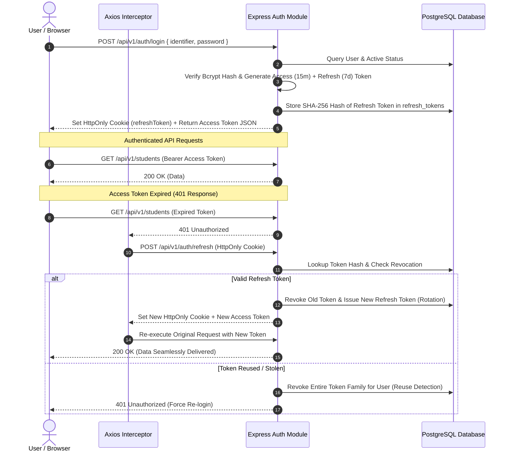

# Maatram Foundation Portal — System Architecture & Design Specification

## 1. Executive Overview

The **Maatram Portal** is an enterprise-grade full-stack platform engineered for the **Maatram Foundation**. It orchestrates the end-to-end operational lifecycle for thousands of underprivileged scholars across Tamil Nadu, encompassing account provisioning, profile management, volunteering log verification, academic portfolio tracking, resume generation, regional zone governance, and analytics.

---

## 2. Technology Stack

```text
┌────────────────────────────────────────────────────────────────────────┐
│                          CLIENT (Frontend)                             │
│  React 18  •  TypeScript  •  Vite  •  Tailwind CSS  •  TanStack Query  │
│  React Router v6  •  Axios  •  Lucide React  •  Framer Motion          │
└───────────────────────────────────┬────────────────────────────────────┘
                                    │ HTTPS / REST API / JSON
┌───────────────────────────────────▼────────────────────────────────────┐
│                          SERVER (Backend API)                          │
│  Node.js (v22)  •  Express  •  TypeScript  •  Prisma ORM (v5)          │
│  JWT Authentication  •  Bcrypt  •  Zod  •  ExcelJS  •  Fast-CSV        │
└───────────────────┬────────────────────────────────┬───────────────────┘
                    │ PostgreSQL Connection Pool     │ Media Uploads
┌───────────────────▼────────────────────────┐  ┌───▼────────────────────┐
│          DATABASE (Storage Engine)         │  │   CLOUDINARY (CDN)     │
│  PostgreSQL (Supabase Managed Engine)      │  │  Profile photos,       │
│  UUID Keys, B-Tree Composite Indexes       │  │  Event photos, Proofs  │
└────────────────────────────────────────────┘  └────────────────────────┘
```

---

## 3. Directory Layout & Module Structure

```text
Maatram-Portal/
├── client/                     # Frontend Single Page Application (Vite + React)
│   ├── public/                 # Favicon icons, Apple touch icon, web manifest
│   ├── src/
│   │   ├── api/                # Axios API clients with auto-refresh interceptors
│   │   ├── assets/             # Brand assets (official Maatram logo)
│   │   ├── components/         # Shared UI (AppLayout, Sidebar, Navbar, Avatar, TableLoader)
│   │   ├── constants/          # Route definitions, role enums, validation schemas
│   │   ├── features/           # Modular domain feature pages:
│   │   │   ├── auth/           # Login, Landing, Forgot/Reset/Change Password
│   │   │   ├── dashboard/      # Role-specific dashboards (Admin, Zone, Student)
│   │   │   ├── student/        # Student Profile, Volunteering Submission & History
│   │   │   ├── organization/   # Provisioning, Active Directory, Archived, Hierarchy, Zones
│   │   │   ├── resume/         # Live Interactive Resume Builder & Public Viewer
│   │   │   ├── analytics/      # Metric dashboards & charts
│   │   │   └── notifications/  # User notification center
│   │   ├── hooks/              # Custom hooks (useAuth, useDebounce, usePagination)
│   │   └── routes/             # RoleGuard and React Router configurations
│
├── server/                     # Backend Enterprise REST API (Express + Prisma)
│   ├── prisma/                 # Database schema definition and migration history
│   ├── src/
│   │   ├── common/             # Exceptions, HTTP status codes, standard response wrappers
│   │   ├── config/             # Database connection, env loader, logger, Cloudinary
│   │   ├── middlewares/        # Auth, RBAC role guard, audit, error handler, rate limit
│   │   ├── modules/            # Domain Business Modules:
│   │   │   ├── auth/           # Login, Token Refresh, Password Reset, Logout
│   │   │   ├── user/           # Admin/Zone user provisioning and status toggles
│   │   │   ├── student/        # Student directory, SPOC toggle, archive scoping, exports
│   │   │   ├── profile/        # Scholar profile updates, semester grades, portfolio
│   │   │   ├── volunteer/      # Submission processing, image upload, incharge review
│   │   │   ├── resume/         # ATS resume aggregation and PDF rendering
│   │   │   ├── zone/           # Zone CRUD, incharge assignment, college affiliations
│   │   │   ├── organization/   # Multi-tier hierarchy aggregation and tree building
│   │   │   ├── analytics/      # Aggregate statistics, volunteering charts, student trends
│   │   │   ├── notification/   # In-app event alerts
│   │   │   └── audit/          # Security and operational audit trail logging
│   │   ├── utils/              # Token signer, password hash, CSV/Excel helpers, query parser
│   │   └── tests/              # Automated integration and regression test suites
│
└── docs/                       # Architectural specs, API reference, Database documentation
```

---

## 4. Security & Authentication Architecture



### Key Security Controls:
1. **Short-Lived Access Tokens**: Signed with `JWT_SECRET`, expiring in 15 minutes.
2. **HttpOnly, Secure Refresh Tokens**: Stored in `SameSite=Strict`, `HttpOnly`, `Secure` cookies with 7-day lifespans.
3. **Automatic Token Rotation**: Every refresh cycle generates a brand-new refresh token and revokes the predecessor.
4. **Token Family Reuse Detection**: If a revoked token is presented, the system immediately invalidates all active sessions for that user ID to stop token theft attacks.
5. **Password Encryption**: Sensitive passwords hashed using Bcrypt with a work factor of 12.
6. **First-Login Enforcement**: Provisioned accounts (`isFirstLogin: true`) are gated until they successfully set a private password via `POST /api/v1/auth/change-password`.

---

## 5. Role-Based Access Control (RBAC) Permissions Matrix

| Feature / Action | Super Admin (`admin`) | Zone Incharge (`zone`) | Student (`student`) | Public |
|---|:---:|:---:|:---:|:---:|
| **Authentication & Profile** | Global | Zone Scope | Own Account | Login Only |
| **Student Provisioning (CSV Import / Manual)** | Full Control | None | None | None |
| **Active Student Directory** | Global (All Zones) | Assigned Zone(s) Only | None | None |
| **Archived Students Directory** | Allowed (Global) | 403 Forbidden | 403 Forbidden | None |
| **SPOC Status Toggle** | Global | Assigned Zone(s) Only | 403 Forbidden | None |
| **Volunteering Submission Review** | Read Only | Approve / Reject in Zone | None | None |
| **Submit Volunteering Logs** | None | None | Own Logs | None |
| **Resume Builder & Preview** | View Any | View in Zone | Edit & View Own | Public Resume Viewer |
| **Organization Hierarchy & Zones** | Full CRUD | View Assigned | None | None |
| **Team Management & User Status** | Full CRUD | None | None | None |
| **Audit Logs** | Global View | None | None | None |
| **Excel / CSV Exports** | Global (Active & Archive) | Zone Scoped (Active) | None | None |

---

## 6. Core Subsystem Workflows

### 6.1. Student Account Lifecycle (Single Source of Truth)

```text
[ Super Admin Provisions Student via CSV / UI ]
                     │
                     ▼
             User.isActive = true
        AccountStatus = pending_first_login
                     │
     ┌───────────────┴───────────────┐
     │                               │
     ▼                               ▼
[ Appears in Student Directory ]  [ Student Activates with Code ]
                                     │
                                     ▼
                              AccountStatus = activated
                                     │
                              [ Changes Temp DOB Password ]
                                     │
                                     ▼
                              AccountStatus = password_changed
                                     │
      ┌──────────────────────────────┴──────────────────────────────┐
      │                                                             │
[ Super Admin Deactivates Account ]                [ Super Admin Reactivates Account ]
      │                                                             │
      ▼                                                             ▼
User.isActive = false                              User.isActive = true
• Disappears from Student Directory                • Restores to Student Directory
• Appears in Archived Students                     • Removes from Archived Students
• Retains all portfolio, SPOC, photos              • SPOC status fully preserved
• Portal login immediately blocked
```

### 6.2. Cloudinary Media Asset Pipeline
1. **Profile Pictures**: Uploaded to Cloudinary with folder prefix `maatram/profiles/`.
2. **On-the-Fly Responsive Transforms**: Frontend `<Avatar />` component dynamically injects `c_thumb,g_face,w_80,h_80,q_auto,f_auto` to deliver optimized facial crops.
3. **Volunteering Proofs & Event Photos**: Uploaded to `maatram/volunteering/` supporting PDF documents and high-resolution images.

---

## 7. Performance & Scalability Design

- **PostgreSQL Connection Pool**: Managed with Prisma client connection pooling.
- **Selective Projections**: Complex directory queries avoid massive nested joins by fetching related IDs and foreign keys using structured Prisma include/select trees.
- **Server-Side Pagination & Debouncing**: Directory tables utilize 400ms debounced search queries combined with deterministic `LIMIT`/`OFFSET` pagination.
- **Export Streaming**: Backend uses `ExcelJS` and `fast-csv` stream buffers to export thousands of scholar records without memory exhaustion.