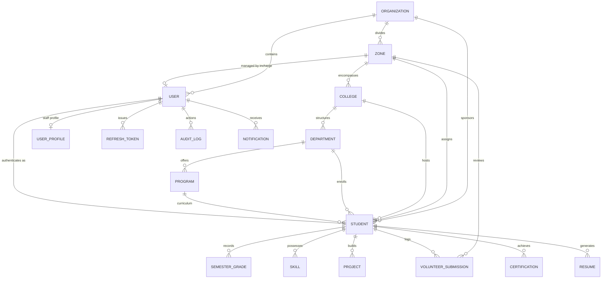

# Maatram Foundation Portal — Database Schema Documentation

## 1. Overview & Architectural Principles

The **Maatram Foundation Student & Volunteer Management System** database is designed for enterprise scalability, strict multi-tenant referential integrity, and complete auditability. It uses **PostgreSQL** hosted on **Supabase** managed through **Prisma ORM**.

### Core Tenets:
- **Single Source of Truth**: Student identity is unified under `User` and `Student` records. Lifecycle changes (e.g., active vs. archived) mutate account flags (`User.isActive`) rather than deleting or duplicating rows.
- **UUID Primary Keys**: All records use cryptographically secure `gen_random_uuid()` UUIDs.
- **Auditing & Timestamps**: Timestamps are stored in UTC (`TIMESTAMPTZ`), and administrative actions generate transactional `audit_logs`.
- **Relational Integrity**: Foreign key constraints with explicit `ON DELETE CASCADE` or `RESTRICT` rules prevent orphan records.
- **Optimized Composite Indexes**: Heavy query paths (filtering by zone, college, SPOC status, volunteering status, and user state) are accelerated with multi-column composite B-Tree indexes.

---

## 2. Entity Relationship Diagram (Mermaid)

---

## 3. Enumerations

### `UserRole`
Defines role-based access control (RBAC) levels:
- `admin`: Super Administrator with global read/write access.
- `zone`: Zone Incharge with scoped access restricted to assigned Zone(s) and associated colleges/students.
- `student`: Scholar student with access restricted to personal profile, volunteering, and resume builder.

### `AccountStatus`
Tracks the student provisioning lifecycle:
- `pending_first_login`: Initial provisioned state awaiting student activation.
- `activated`: Account activated via verification code.
- `password_changed`: Default DOB password changed to secure custom password.

### `StudentStatus`
Academic status of the student:
- `ACTIVE`, `INACTIVE`, `SUSPENDED`, `DROPPED`, `GRADUATED`, `ALUMNI`.

### `VolunteerCategory`
Supported volunteering modalities:
- `TELE_VERIFICATION`
- `PHYSICAL_VERIFICATION`
- `SCHOOL_VISIT`
- `KARPOM_KARPIPOM_TUTORING`
- `OFFLINE_PANEL_VOLUNTEERING`
- `SANGAMAM_VOLUNTEERING`
- `OTHER_OFFLINE_EVENT_VOLUNTEERING`

### `VolunteerStatus`
Workflow state of volunteering submissions:
- `pending`: Awaiting review by Zone Incharge.
- `approved`: Verified and credited towards student hours/counts.
- `rejected`: Rejected with reviewer feedback.

### `NotificationType`
Notification categories for system alerts:
- `approved`, `rejected`, `pending`, `info`, `alert`.

### `AuditActorRole`
Actor classification in audit logs:
- `admin`, `zone`, `student`, `system`.

### `Gender` & `BloodGroup`
- `Gender`: `MALE`, `FEMALE`, `OTHER`, `PREFER_NOT_TO_SAY`.
- `BloodGroup`: `A_POSITIVE`, `A_NEGATIVE`, `B_POSITIVE`, `B_NEGATIVE`, `AB_POSITIVE`, `AB_NEGATIVE`, `O_POSITIVE`, `O_NEGATIVE`.

---

## 4. Detailed Table Specifications

### 4.1. `users` Table
Stores core authentication credentials and system identity for all actors.

| Column | Type | Nullable | Default | Description |
|---|---|---|---|---|
| `id` | `UUID` | No | `gen_random_uuid()` | Primary Key |
| `email` | `VARCHAR(255)` | Yes | NULL | Unique email for staff/students |
| `registerNumber` | `VARCHAR(20)` | Yes | NULL | Unique student registration number |
| `employeeId` | `VARCHAR(50)` | Yes | NULL | Unique staff employee ID |
| `passwordHash` | `TEXT` | No | - | Bcrypt password hash (cost factor 12) |
| `tempPassword` | `TEXT` | Yes | NULL | Plaintext temp DOB password (cleared upon password change) |
| `role` | `UserRole` | No | - | System role (`admin`, `zone`, `student`) |
| `isFirstLogin` | `BOOLEAN` | No | `true` | Requires mandatory password reset on first login |
| `isActive` | `BOOLEAN` | No | `true` | Soft-state lifecycle flag (false = Deactivated/Archived) |
| `lastLoginAt` | `TIMESTAMPTZ`| Yes | NULL | Timestamp of most recent authentication |
| `organizationId` | `UUID` | Yes | NULL | FK to `organizations.id` |
| `zoneId` | `UUID` | Yes | NULL | FK to `zones.id` (for staff assigned to zone) |
| `createdAt` | `TIMESTAMPTZ`| No | `now()` | Record creation timestamp |
| `updatedAt` | `TIMESTAMPTZ`| No | - | Auto-updated on record modification |

**Indexes**:
- `users_email_key` (UNIQUE)
- `users_registerNumber_key` (UNIQUE)
- `users_employeeId_key` (UNIQUE)
- `users_role_idx`
- `users_isActive_idx`
- `users_organizationId_idx`
- `users_zoneId_idx`

---

### 4.2. `students` Table
Comprehensive academic, personal, geographic, and SPOC data for scholars.

| Column | Type | Nullable | Default | Description |
|---|---|---|---|---|
| `id` | `UUID` | No | `gen_random_uuid()` | Primary Key |
| `userId` | `UUID` | No | - | Unique FK to `users.id` (1:1 relation) |
| `registrationNumber` | `VARCHAR(50)` | No | - | Unique Scholar Registration Number |
| `firstName` | `VARCHAR(100)`| No | - | First name |
| `middleName` | `VARCHAR(100)`| Yes | NULL | Middle name |
| `lastName` | `VARCHAR(100)`| No | - | Last name / Initial |
| `gender` | `Gender` | Yes | NULL | Gender enum |
| `dateOfBirth` | `DATE` | No | - | Date of birth |
| `bloodGroup` | `BloodGroup` | Yes | NULL | Blood group enum |
| `nationality` | `VARCHAR(50)` | Yes | NULL | Nationality |
| `community` | `VARCHAR(50)` | Yes | NULL | Social community / caste category |
| `religion` | `VARCHAR(50)` | Yes | NULL | Religion |
| `mobile` | `VARCHAR(15)` | Yes | NULL | Primary mobile number |
| `alternateMobile` | `VARCHAR(15)` | Yes | NULL | Secondary contact number |
| `parentName` | `VARCHAR(100)`| Yes | NULL | Parent / Guardian name |
| `parentMobile` | `VARCHAR(15)` | Yes | NULL | Parent mobile number |
| `parentOccupation`| `VARCHAR(100)`| Yes | NULL | Parent occupation |
| `addressLine1` | `VARCHAR(255)`| Yes | NULL | Permanent street address |
| `addressLine2` | `VARCHAR(255)`| Yes | NULL | Apartment/suite/locality |
| `city` | `VARCHAR(100)`| Yes | NULL | City / Town |
| `district` | `VARCHAR(100)`| Yes | NULL | District |
| `state` | `VARCHAR(100)`| Yes | NULL | State |
| `country` | `VARCHAR(100)`| Yes | NULL | Country |
| `pincode` | `VARCHAR(10)` | Yes | NULL | Postal PIN code |
| `organizationId` | `UUID` | No | - | FK to `organizations.id` |
| `zoneId` | `UUID` | Yes | NULL | FK to `zones.id` |
| `collegeId` | `UUID` | Yes | NULL | FK to `colleges.id` |
| `departmentId` | `UUID` | Yes | NULL | FK to `departments.id` |
| `programId` | `UUID` | Yes | NULL | FK to `programs.id` |
| `stream` | `VARCHAR(50)` | Yes | NULL | Academic stream (`Arts & Science`, `Engineering`, `Nursing`) |
| `course` | `VARCHAR(100)`| Yes | NULL | Degree / Course title |
| `batch` | `VARCHAR(10)` | Yes | NULL | Academic batch (e.g. `2024-2028`) |
| `academicYear` | `VARCHAR(10)` | Yes | NULL | Current year (e.g. `2nd Year`) |
| `semester` | `VARCHAR(20)` | Yes | NULL | Current semester (e.g. `Semester 4`) |
| `section` | `VARCHAR(10)` | Yes | NULL | Academic section |
| `verificationCode`| `VARCHAR(30)` | No | - | Unique secret activation code |
| `resumeLastGeneratedAt` | `TIMESTAMPTZ` | Yes | NULL | Timestamp of latest resume export |
| `accountStatus` | `AccountStatus` | No | `pending_first_login` | Student provisioning state |
| `status` | `StudentStatus` | No | `ACTIVE` | Scholar academic standing |
| `cgpa` | `DECIMAL(4,2)`| Yes | NULL | Cumulative GPA (up to 10.00, auto-computed) |
| `careerObjective`| `TEXT` | Yes | NULL | Personal career summary for resume |
| `profileImage` | `VARCHAR(255)`| Yes | NULL | Cloudinary CDN image URL |
| `isSpoc` | `BOOLEAN` | No | `false` | Student Point of Contact flag |

**Indexes**:
- `students_userId_key` (UNIQUE)
- `students_registrationNumber_key` (UNIQUE)
- `students_verificationCode_key` (UNIQUE)
- `students_stream_idx`
- `students_zoneId_idx`
- `students_collegeId_idx`
- `students_departmentId_idx`
- `students_programId_idx`
- `students_isSpoc_idx`
- `students_isSpoc_zoneId_idx`
- `students_zoneId_collegeId_idx`
- `students_accountStatus_zoneId_idx`

---

### 4.3. `zones`, `colleges`, `departments`, and `programs`

#### `zones`
Represents regional administrative territories.
- `id` (UUID PK), `name` (VARCHAR 100), `code` (VARCHAR 20, UNIQUE), `regionLabel` (VARCHAR 150), `inchargeId` (UUID UNIQUE FK to `users.id`), `organizationId` (UUID FK to `organizations.id`), `isActive` (BOOLEAN).

#### `colleges`
Affiliated educational institutions grouped under zones.
- `id` (UUID PK), `name` (VARCHAR 150), `code` (VARCHAR 20, UNIQUE), `location` (VARCHAR 200), `zoneId` (UUID FK to `zones.id`), `isActive` (BOOLEAN).

#### `departments`
Academic faculties within a college.
- `id` (UUID PK), `name` (VARCHAR 100), `collegeId` (UUID FK to `colleges.id`).

#### `programs`
Degrees and specializations offered by departments.
- `id` (UUID PK), `name` (VARCHAR 100), `departmentId` (UUID FK to `departments.id`), `durationYears` (INT, default 4).

---

### 4.4. `volunteer_submissions` Table
Tracks scholar volunteering activity, proof documents, and approval workflows.

| Column | Type | Nullable | Default | Description |
|---|---|---|---|---|
| `id` | `UUID` | No | `gen_random_uuid()` | Primary Key |
| `submissionCode` | `VARCHAR(30)` | No | - | Unique tracking code (`VLOG-XXXX-XX`) |
| `studentId` | `UUID` | No | - | FK to `students.id` (ON DELETE CASCADE) |
| `zoneId` | `UUID` | No | - | FK to `zones.id` |
| `title` | `VARCHAR(200)`| No | - | Volunteering activity title |
| `category` | `VolunteerCategory` | No | - | Volunteering type |
| `organization` | `VARCHAR(200)`| Yes | NULL | Beneficiary organization / initiative |
| `hours` | `DECIMAL(5,1)`| Yes | NULL | Verified hours logged |
| `count` | `INT` | Yes | NULL | Verified verification counts |
| `imageUrl` | `TEXT` | Yes | NULL | Activity photo URL |
| `eventDate` | `DATE` | No | - | Date event took place |
| `description` | `TEXT` | No | - | Detailed description of service |
| `proofFileUrl` | `TEXT` | Yes | NULL | Cloudinary PDF/Image proof URL |
| `proofFileName`| `VARCHAR(255)`| Yes | NULL | Original filename of uploaded proof |
| `proofFileSizeBytes` | `INT` | Yes | NULL | File size in bytes |
| `status` | `VolunteerStatus` | No | `pending` | Approval state (`pending`, `approved`, `rejected`) |
| `reviewerComment` | `TEXT` | Yes | NULL | Feedback from Zone Incharge |
| `reviewedById` | `UUID` | Yes | NULL | FK to `users.id` (Reviewing Incharge) |
| `reviewedAt` | `TIMESTAMPTZ` | Yes | NULL | Timestamp of review decision |
| `createdAt` | `TIMESTAMPTZ` | No | `now()` | Submission creation timestamp |
| `updatedAt` | `TIMESTAMPTZ` | No | - | Update timestamp |

**Indexes**:
- `volunteer_submissions_submissionCode_key` (UNIQUE)
- `volunteer_submissions_studentId_idx`
- `volunteer_submissions_zoneId_idx`
- `volunteer_submissions_status_idx`
- `volunteer_submissions_zoneId_status_createdAt_idx`
- `volunteer_submissions_studentId_status_eventDate_idx`

---

### 4.5. Student Portfolio Tables (`skills`, `projects`, `certifications`, `semester_grades`)

- **`skills`**: `id` (UUID PK), `studentId` (UUID FK), `skillName` (VARCHAR 50), `addedAt` (TIMESTAMPTZ).
- **`projects`**: `id` (UUID PK), `studentId` (UUID FK), `title` (VARCHAR 200), `description` (TEXT), `techStack` (VARCHAR 500), `githubUrl` (VARCHAR 500), `demoUrl` (VARCHAR 500), `createdAt` (TIMESTAMPTZ).
- **`certifications`**: `id` (UUID PK), `studentId` (UUID FK), `title` (VARCHAR 200), `issuer` (VARCHAR 200), `issueDate` (DATE), `isVerified` (BOOLEAN), `certificateUrl` (TEXT).
- **`semester_grades`**: `id` (UUID PK), `studentId` (UUID FK), `semesterNumber` (INT 1-10), `gpa` (DECIMAL 4,2). Unique constraint on `[studentId, semesterNumber]`.

---

### 4.6. Security, Authentication & Audit Tables

- **`refresh_tokens`**: `id` (UUID PK), `userId` (UUID FK), `tokenHash` (VARCHAR 255 UNIQUE), `expiresAt` (TIMESTAMPTZ), `revokedAt` (TIMESTAMPTZ).
- **`password_reset_tokens`**: `id` (UUID PK), `userId` (UUID FK), `tokenHash` (VARCHAR 255 UNIQUE), `expiresAt` (TIMESTAMPTZ), `usedAt` (TIMESTAMPTZ).
- **`audit_logs`**: `id` (UUID PK), `logCode` (VARCHAR 30 UNIQUE), `actorId` (UUID), `actorRole` (AuditActorRole), `action` (VARCHAR 100), `targetEntityType` (VARCHAR 50), `targetEntityId` (VARCHAR 100), `targetLabel` (VARCHAR 255), `details` (TEXT), `ipAddress` (VARCHAR 45), `userAgent` (TEXT), `createdAt` (TIMESTAMPTZ).
- **`notifications`**: `id` (UUID PK), `recipientId` (UUID FK to `users.id`), `title` (VARCHAR 255), `message` (TEXT), `type` (NotificationType), `isRead` (BOOLEAN default false), `relatedEntityType` (VARCHAR 50), `relatedEntityId` (UUID), `createdAt` (TIMESTAMPTZ).